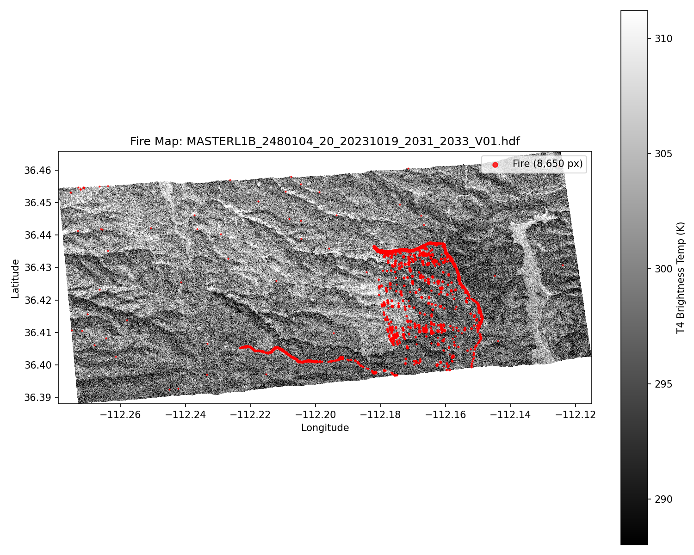
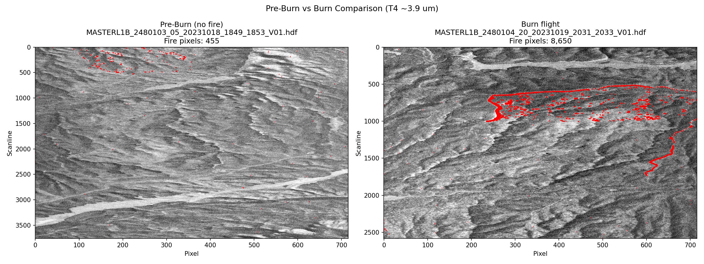

# Fire-Detection
Team Flaming Kitty's AI Fire Detection code! 🔥🐱

## Table of Contents
- [What Is This Data?](#what-is-this-data)
- [How the Instrument Works](#how-the-instrument-works)
- [MASTER Channel Reference](#master-channel-reference)
- [Dataset Parameters](#dataset-parameters)
- [Key Equations](#key-equations)
- [How Fire Detection Works](#how-fire-detection-works)
- [Multi-Pass Consistency Filter](#multi-pass-consistency-filter)
- [SWIR for False Positive Rejection](#swir-for-false-positive-rejection)
- [Flight Mosaics](#flight-mosaics)
- [Vegetation-Loss Fire Confirmation](#vegetation-loss-fire-confirmation)
- [Real-Time Fire Detection](#real-time-fire-detection)
- [ML Fire Detection](#ml-fire-detection)
- [Examples: Fire vs No Fire](#examples-fire-vs-no-fire)
- [Running the Code](#running-the-code)
- [References](#references)

---

## What Is This Data?

This project uses data from the **MASTER** instrument — the **MODIS/ASTER Airborne Simulator**. MASTER is a thermal imaging sensor flown on NASA aircraft that captures images of the ground in 50 different wavelengths (called "channels" or "bands"), ranging from visible light (what your eyes see) all the way to thermal infrared (heat radiation).

The data comes from the **FireSense 2023** campaign, where NASA flew over a **prescribed burn** (a controlled, intentional fire) on the Kaibab Plateau in Arizona during October 18-20, 2023.

### Why 50 channels?

A normal camera captures 3 colors (red, green, blue). MASTER captures 50 "colors" spanning far beyond what the human eye can see. This matters for fire detection because **fire emits very strongly at wavelengths around 3-4 micrometers (μm)** — invisible to the human eye, but clearly visible to MASTER's infrared detectors.

### Flights in the Dataset

| Flight | Date | Description | Day/Night | Files | Fire Present? |
|--------|------|-------------|-----------|-------|---------------|
| 24-801-03 | Oct 18, 2023 | Pre-burn data collection | Day | 9 | **No** — collected before the burn started |
| 24-801-04 | Oct 19, 2023 | First fire flight | Day | 40 | **Yes** — USFS Blowdown Prescribed Burn |
| 24-801-05 | Oct 20, 2023 | Second fire flight (nighttime) | Night | 16 | **Yes** — USFS Lakes Unit Prescribed Burn |
| 24-801-06 | Oct 20, 2023 | Third fire flight | Day | 18 | **Yes** — USFS Blowdown Prescribed Burn |

Each file covers one "flight line" — a single pass of the aircraft over the target area. The aircraft flew back and forth in parallel strips to cover the burn zone.

### File Naming Convention

```
MASTERL1B_2480104_20_20231019_2031_2033_V01.hdf
│         │       │  │        │    │    │
│         │       │  │        │    │    └─ Version
│         │       │  │        │    └────── End time (HHMM UTC)
│         │       │  │        └─────────── Start time (HHMM UTC)
│         │       │  └──────────────────── Date (YYYYMMDD)
│         │       └─────────────────────── Flight line number
│         └─────────────────────────────── Flight ID (248=year, 01=aircraft, 04=flight#)
└───────────────────────────────────────── Product: MASTER Level 1B
```

---

## How the Instrument Works

MASTER sits in the belly of a NASA B200 aircraft and points straight down. A spinning mirror sweeps the sensor's field of view from side to side (cross-track), building up an image line by line as the aircraft flies forward (along-track).

```
     Aircraft flying direction →
     ═══════════╦═══════════
                ║ MASTER sensor
                ║
         ╱─────╨─────╲       Scanning mirror sweeps
        ╱      │       ╲     left to right
       ╱       │        ╲
      ╱        │         ╲
    ─────────────────────────  Ground (716 pixels wide)
    ← pixel 0    pixel 715 →

    Each sweep = 1 "scanline"
    2736 scanlines per file (typical)
```

The result is a 2D image where:
- **Rows** = scanlines (time/along-track direction)
- **Columns** = pixels (cross-track, 716 pixels per line)
- **Depth** = 50 spectral channels

### Calibration

Before and after each scan, the mirror views two internal **blackbody references** — one cold (~10°C) and one warm (~39°C) — whose temperatures are precisely known. By comparing the signal from these references to the signal from the ground, the instrument converts raw detector counts into calibrated **radiance** (the actual amount of energy reaching the sensor). This is what is stored in the Level 1B (L1B) data.


*The two onboard blackbody references maintain stable temperatures throughout the flight, providing the calibration anchors for converting raw counts to physical radiance units.*

---

## MASTER Channel Reference

All 50 channels with their wavelengths and roles:

| Ch | Wavelength (μm) | Band | Role in This Project |
|----|-----------------|------|---------------------|
| 1 | 0.462 | VNIR | — |
| 2 | 0.500 | VNIR | — |
| 3 | 0.542 | VNIR | — |
| 4 | 0.582 | VNIR | — |
| 5 | 0.654 | VNIR | — |
| 6 | 0.712 | VNIR | — |
| 7 | 0.752 | VNIR | — |
| 8 | 0.802 | VNIR | — |
| 9 | 0.866 | VNIR | — |
| 10 | 0.906 | VNIR | — |
| 11 | 0.946 | VNIR | — |
| 12 | 1.602 | SWIR | — |
| 13 | 1.660 | SWIR | — |
| 14 | 1.714 | SWIR | — |
| 15 | 1.768 | SWIR | — |
| 16 | 1.818 | SWIR | — |
| 17 | 1.876 | SWIR | — |
| 18 | 1.928 | SWIR | H₂O absorption |
| 19 | 1.976 | SWIR | H₂O absorption |
| 20 | 2.078 | SWIR | — |
| 21 | 2.162 | SWIR | — |
| **22** | **2.212** | **SWIR** | **Solar reflection channel** — used to distinguish sun glint FP from fire |
| 23 | 2.262 | SWIR | — |
| 24 | 2.320 | SWIR | — |
| 25 | 2.390 | SWIR | — |
| 26 | 4.058 | MWIR | — |
| 27 | 3.286 | MWIR | — |
| 28 | 3.442 | MWIR | — |
| 29 | 3.597 | MWIR | — |
| 30 | 3.746 | MWIR | — |
| **31** | **3.903** | **MWIR** | **T4 — primary fire detection channel** |
| 32 | 4.058 | MWIR | — |
| 33 | 4.245 | MWIR | — |
| 34 | 4.379 | MWIR | CO₂ absorption |
| 35 | 4.516 | MWIR | — |
| 36 | 4.668 | MWIR | — |
| 37 | 4.819 | MWIR | — |
| 38 | 4.966 | MWIR | — |
| 39 | 5.110 | MWIR | — |
| 40 | 5.258 | MWIR | — |
| 41 | 7.785 | TIR | — |
| 42 | 8.188 | TIR | — |
| 43 | 8.620 | TIR | — |
| 44 | 9.054 | TIR | — |
| 45 | 9.695 | TIR | O₃ absorption |
| 46 | 10.107 | TIR | — |
| 47 | 10.637 | TIR | — |
| **48** | **11.327** | **TIR** | **T11 — background temperature channel** |
| 49 | 12.135 | TIR | — |
| 50 | 12.874 | TIR | — |

### Band Groups Summary

| Band Group | Channels | Wavelength Range | What They See |
|------------|----------|-----------------|---------------|
| **VNIR** (Visible/Near-IR) | 1–11 | 0.46 – 0.95 μm | Reflected sunlight. Similar to what a camera sees, plus near-infrared. Useful for vegetation, clouds, land cover. |
| **SWIR** (Short-Wave IR) | 12–25 | 1.60 – 2.39 μm | Mix of reflected sunlight and thermal emission. Sensitive to minerals, soil moisture. **Ch 22 (2.21 μm)** used to identify reflective surfaces causing false positives. |
| **MWIR** (Mid-Wave IR) | 26–40 | 3.29 – 5.26 μm | **The fire detection sweet spot.** Fire (600–1200 K) emits enormously more radiation than cool background (~300 K). **Ch 31 (3.90 μm)** is the primary fire channel. |
| **TIR** (Thermal IR) | 41–50 | 7.79 – 12.87 μm | Pure thermal emission. Measures surface temperature regardless of sunlight. **Ch 48 (11.33 μm)** provides background temperature. |

---

## Dataset Parameters

Each HDF4 file contains 38 datasets. Here are the important ones grouped by category:

### The Main Science Data

| Dataset | Shape | Units | What It Is |
|---------|-------|-------|------------|
| `CalibratedData` | (2736, 50, 716) | W/m²/sr/μm | **The primary data product.** Calibrated spectral radiance for every pixel in every channel. This is the energy per unit area, per steradian (viewing angle), per micrometer of wavelength reaching the sensor. Has a per-channel `scale_factor` that must be multiplied in. |

### Geolocation — Where Each Pixel Is

| Dataset | Shape | Units | What It Is |
|---------|-------|-------|------------|
| `PixelLatitude` | (2736, 716) | degrees | Latitude of each pixel on the ground. -90 (South Pole) to +90 (North Pole). |
| `PixelLongitude` | (2736, 716) | degrees | Longitude of each pixel. -180 (West) to +180 (East). |
| `PixelElevation` | (2736, 716) | meters MSL | Ground elevation at each pixel location. |

### Spectral Channel Information

| Dataset | Shape | Units | What It Is |
|---------|-------|-------|------------|
| `Central100%ResponseWavelength` | (50,) | μm | The nominal center wavelength for each of the 50 channels. Ranges from 0.46 μm (blue visible) to 12.86 μm (thermal infrared). |
| `EffectiveCentralWavelength_IR_bands` | (50,) | μm | The **effective** center wavelength, accounting for the shape of each channel's spectral response. More accurate than the nominal value for converting radiance to temperature. Only valid for IR channels (26-50); filled with -99 for visible channels. |
| `Left50%ResponseWavelength` | (50,) | μm | The short-wavelength edge of each channel's spectral response (at 50% of peak). |
| `Right50%ResponseWavelength` | (50,) | μm | The long-wavelength edge. Together with the left edge, these define the bandwidth of each channel. |
| `SolarSpectralIrradiance` | (50,) | W/m²/μm | How much sunlight arrives at the top of the atmosphere in each channel's band. Used for reflectance calculations. |

### Viewing and Solar Geometry

| Dataset | Shape | Units | What It Is |
|---------|-------|-------|------------|
| `SolarZenithAngle` | (2736, 716) | degrees | Angle from directly overhead to the sun. 0° = sun overhead, 90° = sun on horizon. Used to classify day (< 85°) vs night (≥ 85°). |
| `SolarAzimuthAngle` | (2736, 716) | degrees | Compass direction from each pixel to the sun. |
| `SensorZenithAngle` | (2736, 716) | degrees | Angle from straight down (nadir) to the sensor. Pixels at the edge of the swath have larger angles. |
| `SensorAzimuthAngle` | (2736, 716) | degrees | Compass direction from each pixel to the sensor. |

### Aircraft Navigation

| Dataset | Shape | Units | What It Is |
|---------|-------|-------|------------|
| `AircraftLatitude` | (2736,) | degrees | Aircraft position (one value per scanline). |
| `AircraftLongitude` | (2736,) | degrees | |
| `AircraftAltitude` | (2736,) | meters MSL | Flight altitude. |
| `AircraftHeading` | (2736,) | degrees true | Compass heading. |
| `AircraftPitch` | (2736,) | degrees | Nose up/down angle. |

### Calibration Parameters

| Dataset | Shape | Units | What It Is |
|---------|-------|-------|------------|
| `BlackBody1Temperature` | (2736,) | °C (×scale_factor) | Temperature of the cold calibration reference. |
| `BlackBody2Temperature` | (2736,) | °C (×scale_factor) | Temperature of the warm calibration reference. |
| `TBack` | (2736,) | Kelvin | Background/instrument temperature. |
| `CalibrationSlope` | (2736, 50) | W/m²/sr/μm per count | Gain: how much radiance per raw detector count. |
| `CalibrationIntercept` | (2736, 50) | W/m²/sr/μm | Offset in the calibration equation. |
| `TemperatureCorrectionSlope` | (50,) | unitless | Post-Planck brightness temperature correction (slope). See [equations](#temperature-correction) below. |
| `TemperatureCorrectionIntercept` | (50,) | Kelvin | Post-Planck brightness temperature correction (intercept). |

### Timing

| Dataset | Shape | Units | What It Is |
|---------|-------|-------|------------|
| `ScanlineTime` | (2736,) | hours (UTC) | Time of each scanline as decimal hours. |
| `YearMonthDay` | (2736,) | YYYYMMDD | Date stamp per scanline. |
| `GreenwichMeanTime` | (2736,) | — | GMT time reference. |

---

## Key Equations

### Blackbody Radiation and the Planck Function

Every object above absolute zero (0 K / -273.15°C) emits thermal radiation. The **Planck function** describes how much radiation a perfect emitter (a "blackbody") produces at each wavelength for a given temperature:

$$L(\lambda, T) = \frac{2hc^2}{\lambda^5} \cdot \frac{1}{e^{hc / \lambda k T} - 1}$$

Where:
| Symbol | Value | Meaning |
|--------|-------|---------|
| $L$ | — | Spectral radiance (W/m²/sr/m) |
| $\lambda$ | — | Wavelength (m) |
| $T$ | — | Temperature (K) |
| $h$ | 6.626 × 10⁻³⁴ J·s | Planck's constant |
| $c$ | 2.998 × 10⁸ m/s | Speed of light |
| $k$ | 1.381 × 10⁻²³ J/K | Boltzmann's constant |

### Why Fire Is Bright at 3.9 μm

The Planck function peaks at shorter wavelengths for hotter objects (**Wien's displacement law**: $\lambda_{peak} = 2898 / T$ μm). For a background surface at 300 K (~27°C), the peak emission is around 9.7 μm. For a fire at 800 K (~527°C), the peak shifts to 3.6 μm.

At 3.9 μm, the radiance from an 800 K fire is **orders of magnitude** greater than from a 300 K surface. At 11 μm, the difference is much smaller. This is why the 3.9 μm channel is the primary fire detection band — even a tiny sub-pixel fire produces a massive signal increase.

```
Radiance at 3.9 μm:
  300 K background:  ~0.26 W/m²/sr/μm
  800 K fire:        ~5,985 W/m²/sr/μm   ← 23,000× brighter!

Radiance at 11 μm:
  300 K background:  ~9.8 W/m²/sr/μm
  800 K fire:        ~41.2 W/m²/sr/μm    ← only 4× brighter
```

### Inverse Planck Function (Radiance → Brightness Temperature)

MASTER measures radiance. To convert it to **brightness temperature** (the temperature a blackbody would need to emit that radiance), we invert the Planck function:

$$T_B = \frac{hc}{\lambda k} \cdot \frac{1}{\ln\left(\frac{2hc^2}{\lambda^5 L} + 1\right)}$$

Or equivalently, using the radiation constants $c_1 = 2hc^2$ and $c_2 = hc/k$:

$$T_B = \frac{c_2}{\lambda \cdot \ln\left(\frac{c_1}{\lambda^5 L} + 1\right)}$$

Where:
| Constant | Value |
|----------|-------|
| $c_1$ | 1.191 × 10⁻¹⁶ W·m² |
| $c_2$ | 1.439 × 10⁻² m·K |

In Python:
```python
def radiance_to_brightness_temp(radiance_Wm2_sr_um, wavelength_um):
    h = 6.62607015e-34  # Planck constant (J·s)
    c = 2.99792458e8    # Speed of light (m/s)
    k = 1.380649e-23    # Boltzmann constant (J/K)

    lam = wavelength_um * 1e-6            # convert μm → m
    L = radiance_Wm2_sr_um * 1e6          # convert W/m²/sr/μm → W/m²/sr/m

    c1 = 2.0 * h * c**2
    c2 = h * c / k

    T_b = c2 / lam / np.log(1.0 + c1 / (lam**5 * L))
    return T_b  # Kelvin
```

### Temperature Correction

Because each channel integrates over a range of wavelengths (not a single wavelength), the inverse Planck function introduces a small systematic error. MASTER provides correction coefficients to fix this:

$$T_{corrected} = \text{slope} \times T_{Planck} + \text{intercept}$$

The slope is very close to 1.0 (e.g., 0.9995) and the intercept is a fraction of a Kelvin (e.g., 0.30 K). These corrections are only meaningful for thermal/IR channels 26-50.

---

## How Fire Detection Works

Our algorithm is inspired by the **MODIS MOD14** active fire detection product (Giglio et al., 2016). It uses two complementary tests:

### Test 1: Absolute Threshold ("Is the temperature above X?")

A pixel is flagged as fire if:
- **Daytime** (solar zenith angle < 85°): $T_4 > 325\text{ K}$ (52°C)
- **Nighttime** (solar zenith angle ≥ 85°): $T_4 > 310\text{ K}$ (37°C)
- AND the temperature difference $\Delta T = T_4 - T_{11} > 10\text{ K}$

Where $T_4$ is brightness temperature at ~3.9 μm (Channel 31) and $T_{11}$ is at ~11.25 μm (Channel 48).

The $\Delta T$ requirement is critical — it distinguishes fire from surfaces that are simply warm (like sun-heated bare rock). Fire has a unique spectral signature: disproportionately high emission at 3.9 μm compared to 11 μm.

### Test 2: Contextual Anomaly ("Is this pixel hotter than its neighbors?")

A pixel is flagged as fire if:
- $T_4 > \bar{T_4} + 3\sigma_{T_4}$ (more than 3 standard deviations above the local mean)
- AND $\Delta T > \overline{\Delta T} + 3\sigma_{\Delta T}$ (delta-T also anomalous)
- AND $\Delta T > 10\text{ K}$ (minimum sanity check)

The local mean ($\bar{T}$) and standard deviation ($\sigma$) are computed over a 61×61 pixel window (~3 km) surrounding each pixel.

This test catches smaller or cooler fires that may not exceed the absolute threshold but are clearly anomalous compared to their surroundings.

### Combined Result

A pixel is classified as **fire** if it passes **either** test (union). This gives us two types of fire pixels:
- **Absolute detections** (red): intense fires exceeding the hard temperature threshold
- **Contextual detections** (orange): anomalously warm pixels relative to their local background

---

## Multi-Pass Consistency Filter

### Problem

The mosaic assembles multiple flight lines into a single image. Previously, fire detection used OR logic: if a pixel triggered the fire threshold in **any** flight line, it was marked as fire. But the same ground pixel is observed from multiple flight lines at different viewing angles.

False positives from solar reflection are **angle-dependent** — they trigger in one pass but not others. Real fire emits thermally in all directions (isotropic) and triggers **consistently** across passes.

### Solution

Instead of OR logic, we track how many times each grid cell was:
1. **Observed** (any valid data from any flight line)
2. **Detected as fire** (triggered the threshold)

A pixel is only classified as fire if it was detected in **at least 2 passes** when observed multiple times. Single-observation pixels keep their detection (no multi-pass info available to filter).

```python
# Per grid cell, across all flight lines:
grid_obs_count[r, c] += 1                                  # count every valid observation
grid_fire_count[r, c] += fire[in_bounds].astype(np.int32)  # count fire detections

# Final fire mask with consistency threshold:
multi_pass = grid_obs_count >= 2
grid_fire = np.where(
    multi_pass,
    grid_fire_count >= 2,    # seen multiple times → require ≥2 detections
    grid_fire_count >= 1     # seen only once → keep single detection
)
```

### Results

| Flight | Before (OR) | After (consistency) | Eliminated |
|--------|------------|--------------------|-----------:|
| 03 (pre-burn, no fire) | 135 FP | 65 FP | **70 (52%)** |
| 04 (day burn) | ~3,100 | 3,064 (3,045 multi-pass, 19 single-pass) | ~36 |
| 05 (night burn) | ~1,730 | 1,712 (1,704 multi-pass, 8 single-pass) | ~18 |
| 06 (day burn) | ~3,320 | 3,305 (3,293 multi-pass, 12 single-pass) | ~15 |

The filter cut pre-burn false positives by 52%. Real fire detections are >99% multi-pass confirmed, validating the physics: fire emission is isotropic and triggers consistently regardless of viewing angle, while solar reflection artifacts are angle-dependent and trigger inconsistently.

---

## SWIR for False Positive Rejection

### Why SWIR Matters

The remaining false positives are pixels where sun-heated rock or soil reflects sunlight strongly at 3.9 μm, mimicking a fire signal. The **Short-Wave Infrared (SWIR)** at 2.16 μm (Channel 22) helps distinguish these:

| Source | T4 (3.9 μm) | SWIR (2.16 μm) | Reason |
|--------|-------------|-----------------|--------|
| **Fire** | Very high (thermal emission) | Low-to-moderate | Fire emits thermally; at 2.16 μm, a 800 K fire emits far less than at 3.9 μm |
| **Sun-heated rock** | Elevated (solar reflection) | **High** (solar reflection) | Rock reflects sunlight across the entire solar spectrum including SWIR |
| **Background** | Low (~300 K) | Moderate | Normal terrain with typical solar reflectance |

During **daytime**: high SWIR with high T4 suggests reflection (false positive), while high T4 with low SWIR suggests fire.

During **nighttime**: SWIR is near-zero for everything (no sunlight), so it provides no discrimination — but nighttime flights already have fewer FP because there's no solar reflection.

### Implementation

SWIR radiance from Channel 22 (2.212 μm) is extracted alongside T4 and T11, gridded onto the mosaic, and available as:
- A visual diagnostic (bottom-left panel in burn location plots)
- A 4th feature for the ML model: `[T4, T11, ΔT, SWIR]`

---

## Flight Mosaics

`mosaic_flight.py` assembles all flight lines from a single flight into one georeferenced composite image.

### What It Does

Each HDF4 file contains one flight line — a single pass of the aircraft over the target area. A full flight consists of many parallel passes (9 to 40 lines). The script:

1. Groups all HDF files by flight number
2. Creates a regular latitude/longitude grid covering the full flight extent
3. Processes each file in chronological order, projecting pixels onto the grid
4. Runs fire detection on each file
5. Applies the multi-pass consistency filter
6. Composites everything into a single image per flight

```
Flight line 1:   ═══════════════
Flight line 2:     ═══════════════
Flight line 3:   ═══════════════
    ...                              →  Combined mosaic
Flight line N:     ═══════════════
```

### Key Variables

- **grid_T4** — Brightness temperature at **~3.9 μm** (Channel 31) [K]. The **fire detection channel**. Fire (600–1200 K) can be **23,000× brighter** than the cool background (~300 K) at this wavelength.
- **grid_T11** — Brightness temperature at **~11.25 μm** (Channel 48) [K]. The **background temperature channel**. Fire is only ~4× brighter than background at this wavelength.
- **grid_SWIR** — Calibrated radiance at **~2.16 μm** (Channel 22) [W/m²/sr/μm]. The **solar reflection channel**. High values during daytime indicate reflective surfaces.
- **grid_fire_count** — Number of times each grid cell was detected as fire across all flight lines.
- **grid_obs_count** — Number of times each grid cell was observed (any valid data).

| Scenario | T4 (3.9 μm) | T11 (11.25 μm) | ΔT = T4 − T11 | Detected? |
|----------|-------------|-----------------|----------------|-----------|
| Cool ground | 290 K | 288 K | 2 K | No — both low, small ΔT |
| Sun-heated rock | 320 K | 315 K | 5 K | No — warm but ΔT < 10 K |
| Active fire | 600 K | 330 K | 270 K | **Yes** — T4 > 325 K AND ΔT > 10 K |

### Grid Construction

- **Bounding box**: From `lat_LL/UL/LR/UR` and `lon_LL/UL/LR/UR` attributes plus 0.005° (~550 m) buffer
- **Resolution**: 0.00025° per grid cell ≈ **28 meters** at 36°N latitude
- **Orientation**: Row 0 = northernmost latitude (top), Column 0 = westernmost longitude (left)

| Resolution | Grid size (Flight 04) | Tradeoff |
|-----------|----------------------|----------|
| 0.00007° (~8 m, native) | ~2200 × 5600 = 12M cells | Full detail, slower processing |
| **0.00025° (~28 m, default)** | **~730 × 1120 = 817K cells** | **Good detail, fast** |
| 0.001° (~111 m) | ~180 × 280 = 50K cells | Quick preview, blurry |

### Fire Detection in the Mosaic

Uses a simplified absolute threshold (no contextual test) for speed:
- **T4 > threshold**: 325 K (day) or 310 K (night)
- **ΔT > 10 K**: Confirms spectral fire signature

| | Daytime | Nighttime |
|---|---------|-----------|
| **Threshold** | 325 K (52°C) | 310 K (37°C) |
| **Background T4** | 290–320 K | 260–290 K |
| **Reason** | Solar heating warms surfaces to 310–320 K | No solar heating; background cools significantly |

### Assumptions and Limitations

1. **Flat-grid approximation**: Equirectangular projection. At 36°N over ~0.3°, distortion is <0.5%.
2. **Nearest-neighbor resampling**: Each source pixel maps to the single nearest grid cell. No interpolation.
3. **No atmospheric correction**: Acceptable for fire detection because fire signals dominate atmospheric effects.
4. **Simplified fire detection**: Only absolute threshold test (not contextual anomaly) for processing speed.
5. **Temporal compositing**: "Last write wins" for T4/T11/SWIR. Fire mask uses multi-pass consistency.
6. **Day/night classification**: Per-flight, not per-pixel.

---

## Vegetation-Loss Fire Confirmation

### The Idea

Thermal fire detection alone can produce false positives from solar glint, hot rock, or instrument artifacts. If a pixel is truly on fire, the vegetation at that location should be **disappearing** — NDVI drops as plants burn. By tracking NDVI over time, we can independently confirm that a thermal detection is real fire.

### How It Works

1. **NDVI baseline**: The first valid daytime NDVI observation at each pixel is stored as the baseline (typically from a pre-burn flight).
2. **Vegetation loss detection**: On subsequent sweeps, if a pixel has both a thermal fire detection AND an NDVI drop of ≥ 0.15 from baseline, it is marked as **vegetation-confirmed fire**.
3. **Burn scar visualization**: At confirmed pixels, the VNIR update rule switches from "keep greenest" to "keep latest", so the NDVI background naturally turns brown as fire consumes vegetation.
4. **Multi-pass boost**: Vegetation-confirmed fire pixels pass the multi-pass consistency filter even with only 1 thermal detection (since vegetation loss is independent confirmation).

### Threshold

The NDVI drop threshold is 0.15 (absolute, not percentage):
- Healthy grassland NDVI: 0.3–0.6
- Burned vegetation NDVI: -0.1 to 0.1
- Measurement noise from illumination angle changes: ~0.05

A drop of 0.15 is conservative enough to avoid false triggers from atmospheric or angular variation.

### Visualization

In the real-time simulation output:
- **Red dots**: Thermal-only fire detections
- **Orange dots**: Vegetation-confirmed fire (thermal + NDVI drop)
- The stats box shows the count of veg-confirmed pixels

### Requirements

Vegetation-loss confirmation requires:
- At least one pre-burn daytime flight (to establish NDVI baseline)
- Grid state persistence across flights (`gs` passed between `simulate_flight()` calls)
- Daytime observations at fire locations (nighttime NDVI is NaN)

---

## Real-Time Fire Detection

`realtime_fire.py` simulates real-time fire detection as the plane sweeps, processing one flight line at a time and incrementally building a mosaic.

### How It Works

1. The grid starts empty (0×0) and grows dynamically as each sweep arrives
2. Each sweep's HDF corner attributes determine if the grid needs to expand
3. Fire detection runs on each sweep; the multi-pass consistency filter updates incrementally
4. NDVI baseline is tracked for vegetation-loss confirmation
5. One PNG frame is rendered per sweep showing the current state

### Output

Each flight produces a directory of frames: `plots/realtime_<flight>/frame_001.png`, `frame_002.png`, etc.

To create an animated GIF (requires [ImageMagick](https://imagemagick.org/)):
```bash
convert -delay 50 -loop 0 plots/realtime_2480104/frame_*.png plots/realtime_2480104/animation.gif
```

### What the Operator Sees

- **Green background (NDVI)**: Healthy vegetation during daytime flights
- **Brown/red areas**: Burn scars where vegetation has been consumed (visible after vegetation-loss confirmation updates the NDVI layer)
- **Red dots**: Thermal fire detections
- **Orange dots**: Vegetation-confirmed fire (higher confidence)
- **Yellow labels**: Fire zone IDs with area in m² or hectares
- **Stats box**: Sweep count, coverage, fire pixels, veg-confirmed count, zone breakdown

### Dynamic Grid Expansion

Unlike `mosaic_flight.py` which pre-scans all files to determine the grid bounds, `realtime_fire.py` grows the grid dynamically. On each sweep:
- If the grid is empty, it initializes from that sweep's extent
- If the sweep extends beyond current bounds, all arrays are expanded and old data is copied at the correct offset
- This simulates a real-time scenario where the plane doesn't know its future flight path

---

## ML Fire Detection

`fire_ml.py` trains a neural network to classify fire vs. non-fire pixels using 4 spectral features.

### Features

| Feature | Source | Units | Why It Helps |
|---------|--------|-------|-------------|
| T4 | Channel 31 (3.9 μm) | K | Primary fire signal — fire is extremely bright at this wavelength |
| T11 | Channel 48 (11.3 μm) | K | Background temperature — provides thermal context |
| ΔT | T4 − T11 | K | Spectral fingerprint — fire has disproportionately high T4 vs T11 |
| SWIR | Channel 22 (2.2 μm) | W/m²/sr/μm | Solar reflection — high SWIR with high T4 suggests reflection, not fire |

### Loss Function: Soft Dice Loss

Standard losses like binary cross-entropy (BCE) are diluted by the massive number of true negatives (~99.4% of pixels are not fire). Dice Loss operates on absolute TP/FP/FN counts:

$$\text{Dice Loss} = 1 - \frac{2 \cdot TP}{2 \cdot TP + FP + FN}$$

True negatives (TN) **do not appear** in the formula. 100 FP out of 1,000 pixels gives the same loss as 100 FP out of 1,000,000 pixels. Every false positive and every missed fire directly degrades the score.

For training, we use a combined **Dice + BCE** loss (50/50 weight) — BCE provides per-pixel gradient signals that help early training converge when Dice alone gets stuck.

### Architecture

```
Input (4 features) → Linear(64) → ReLU → Linear(32) → ReLU → Linear(1) → Sigmoid
```

2,337 parameters. Trained with minority class oversampling (fire upsampled to 50/50 balance).

### Train/Test Split

- **Train**: Flights 03 (pre-burn) + 04 (day burn) + 05 (night burn)
- **Test**: Flight 06 (day burn, unseen)
- Labels: Pseudo-labels from the threshold detector

---

## Examples: Fire vs No Fire

### Pre-Burn (No Fire)

**File:** `MASTERL1B_2480103_05_20231018_1849_1853_V01.hdf`
**Flight:** 24-801-03 (October 18, 2023) — collected the day before the prescribed burn

```
T4  range: 225.1 - 445.4 K (-48.0 - 172.3°C)
T11 range: 276.7 - 358.1 K
ΔT  range: -65.8 - 138.4 K
Fire pixels: 455 (0.017% of image) — false positives from edge artifacts
```


**What you see:**
- **Top left (T4, 3.9 μm):** Warm and cool terrain visible. Bright streaks are exposed rock or bare soil reflecting sunlight. The temperature range is typical for unburned Arizona plateau in October.
- **Top right (T11, 11 μm):** Similar terrain pattern but with less contrast. This wavelength is less sensitive to reflected sunlight.
- **Bottom left (ΔT = T4 − T11):** Mostly uniform (values near 0-5 K). No strong anomalies — the 3.9 μm and 11 μm channels agree because there is no fire.
- **Bottom right (Fire overlay):** A few scattered red/orange dots (455 total, 0.017% of pixels). These are false positives caused by bright bare soil or edge-of-scan artifacts where the viewing angle is extreme. They are **not spatially clustered** — this is the key indicator that they are not real fire.

### Active Burn (Fire Present)

**File:** `MASTERL1B_2480104_20_20231019_2031_2033_V01.hdf`
**Flight:** 24-801-04 (October 19, 2023) — during the USFS Blowdown Prescribed Burn

```
T4  range: 255.9 - 800.0 K (-17.2 - 526.8°C)
T11 range: 114.9 - 416.8 K
ΔT  range: -65.2 - 472.9 K
Fire pixels: 8,650 (0.468% of image)
```


**What you see:**
- **Top left (T4, 3.9 μm):** Bright white/yellow features appear that were not present in the pre-burn image. These are fire pixels reaching up to 800 K (527°C) — the sensor may even be saturating on the hottest pixels.
- **Top right (T11, 11 μm):** The fire is visible but much less prominent. The hottest fire pixels only reach ~417 K at 11 μm vs 800 K at 3.9 μm. This wavelength difference is exactly what the fire detection algorithm exploits.
- **Bottom left (ΔT = T4 − T11):** The fire area lights up dramatically — ΔT values reaching 473 K. The background remains near 0-10 K. This is the spectral "fingerprint" of fire.
- **Bottom right (Fire overlay):** 8,650 fire pixels, clearly **clustered in a coherent spatial pattern** matching the shape of the burn area. Red = absolute threshold detections, orange = contextual anomaly detections.

### Georeferenced Fire Map



The fire pixels plotted on their actual geographic coordinates (latitude/longitude) on the Kaibab Plateau. The fire perimeter follows the terrain — you can see it tracing along ridgelines and valleys where the prescribed burn was conducted.

### Side-by-Side Comparison



The comparison makes it clear: the pre-burn scene (left) shows no coherent fire pattern, while the burn scene (right) shows a dense cluster of fire detections.

### Multi-Channel Overview


This shows the same scene across 6 different channels spanning the full spectrum (VNIR through TIR), demonstrating how different wavelengths reveal different surface features.

---

## Running the Code

### Requirements

```
pip install -r requirements.txt
```

Note: `pyhdf` may require HDF4 libraries. On macOS with conda/mamba:
```
conda install -c conda-forge pyhdf
```

### Downloading the Data

The MASTER L1B data is publicly available from the [ORNL DAAC](https://daac.ornl.gov/cgi-bin/dsviewer.pl?ds_id=2330) (DOI: [10.3334/ORNLDAAC/2330](https://doi.org/10.3334/ORNLDAAC/2330)). A download script is included that handles authentication and fetches the correct flights automatically:

```bash
# First: create a free account at https://urs.earthdata.nasa.gov/

python download_data.py                # download all 4 flights (~83 files, ~9 GB)
python download_data.py --flight 04    # download only flight 24-801-04
python download_data.py --list         # list available files without downloading
```

The script will prompt for your NASA Earthdata credentials on first run and cache them in `~/.netrc` for future use. Files are saved to `ignite_fire_data/`.

### Scripts

| Script | Purpose |
|--------|---------|
| `download_data.py` | Download MASTER L1B data from NASA Earthdata |
| `plotdata.py` | Explore the HDF files — plots radiance across channels and a georeferenced thermal image |
| `detect_fire.py` | Run fire detection — compares a pre-burn file to a burn file, produces detection maps |
| `mosaic_flight.py` | Assemble all flight lines into a single georeferenced mosaic per flight with multi-pass consistency filter |
| `plot_burn_locations.py` | Per-flight 2x2 analysis: burn locations, T4, SWIR, and detection space scatter |
| `plot_vegetation.py` | 2x2 NDVI vegetation maps with fire overlay (daytime flights) |
| `realtime_fire.py` | Real-time sweep-by-sweep fire detection simulation with fire zone labels |
| `fire_ml.py` | Train ML fire detector with Dice Loss using T4, T11, ΔT, SWIR features |

```bash
python detect_fire.py
```

This produces (in `plots/`):
- `fire_detection_preburn.png` — 4-panel analysis of pre-burn scene
- `fire_detection_burn.png` — 4-panel analysis of burn scene
- `fire_map_burn.png` — georeferenced fire pixel map
- `fire_comparison.png` — side-by-side comparison

```bash
python mosaic_flight.py
```

This produces one mosaic per flight in `plots/`:
- `mosaic_flight_2480103.png` — Pre-burn, 9 lines composited
- `mosaic_flight_2480104.png` — First fire flight, 40 lines composited
- `mosaic_flight_2480105.png` — Night fire flight, 16 lines composited
- `mosaic_flight_2480106.png` — Third fire flight, 14 lines composited

```bash
python plot_burn_locations.py
```

This produces one PNG per flight in `plots/`, each with a 2x2 layout (burn locations, T4, SWIR, detection space scatter):
- `burn_locations_2480103.png` — Pre-burn false positive analysis
- `burn_locations_2480104.png` — First fire flight (Blowdown)
- `burn_locations_2480105.png` — Night fire flight (Lakes Unit)
- `burn_locations_2480106.png` — Third fire flight (Blowdown)

```bash
python fire_ml.py
```

This trains the ML model and produces:
- `ml_training_loss.png` — Dice Loss convergence curve
- `ml_decision_boundary.png` — Learned decision boundary vs threshold lines
- `ml_prediction_map_2480106.png` — Spatial fire predictions on test flight
- `ml_fpfn_comparison_2480106.png` — FP/FN spatial map

### Data

The data is from the **MASTER: FireSense, western US, October 2023** dataset:
- **ORNL DAAC**: [doi.org/10.3334/ORNLDAAC/2330](https://doi.org/10.3334/ORNLDAAC/2330) (citable, requires free [Earthdata login](https://urs.earthdata.nasa.gov/))
- **NASA ASAP Archive**: [firesense_2023](https://asapdata.arc.nasa.gov/sensors/master/data/deploy_html/firesense_2023.html)

The easiest way to get the data is `python download_data.py` (see above). Or place MASTER L1B HDF4 files manually in `ignite_fire_data/`. The specific flights used are 24-801-03 through 24-801-06 (October 18-20, 2023, Kaibab National Forest, Arizona).

All plots are saved to the `plots/` directory.

---

## References

- Giglio, L., Schroeder, W., & Justice, C. O. (2016). The collection 6 MODIS active fire detection algorithm and fire products. *Remote Sensing of Environment*, 178, 31-41.
- [MASTER Instrument Overview](https://asapdata.arc.nasa.gov/sensors/master/)
- [MODIS Active Fire Product](https://modis.gsfc.nasa.gov/data/dataprod/mod14.php)
